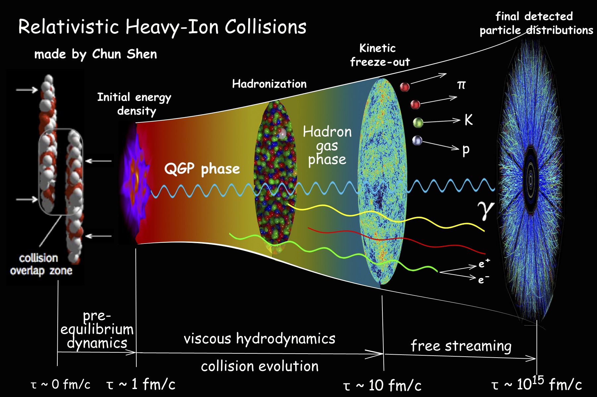

.. iEBE-MUSIC documentation master file, created by
   sphinx-quickstart on Thu Jan  2 12:30:32 2020.
   You can adapt this file completely to your liking, but it should at least
   contain the root `toctree` directive.

Welcome to iEBE-MUSIC's documentation!
######################################

The iEBE-MUSIC is a general framework to simulate the multi-stage
3D dynamics of relativistic heavy-ion collisions event-by-event.

Introduction and Background
***************************

We study the collective phenomena emerged from many-body Quantum Chromodynamics
(QCD) by colliding ionized heavy nuclei at high energy, relativsitic
heavy-ion collisions. These collisions can create extreme conditions, under
which quarks and gluons are deconfined from individual hadrons and form
a new state of matter called the Quark-Gluon Plasma (QGP).
The dynamics of the relativistic heavy-ion collisions happens on an extremly
short time scale. During only a few yatoseconds :math:`(\sim 10^{-24} s)`,
the collision system goes through a complex multi-stage evolution.
First, it rapidly evolves from a far out-of-equilibrium phase to a
strongly coupled fluid-dynamic regime within ~ 1 fm/c.
As the system further expands and cools, the QGP smoothly transits to the
hadorn gas phase, where the quarks and gluons recombine into hadrons.
These hadrons will scatter with each other and eventually decoupled
and fly freely to the detectors.
Because of this series of dynamics is ultra-fast, we can not directly probe
the QGP during the collisions using any external probes.
Theoretical simulations are essential to rewind the final
measured particle momentum distributions to early stages of the collisions.
These phenomenological studies help us to study the properties of the
strongly-coupled QGP.

          heavy-ion collisions.

.. toctree::
   :maxdepth: 2
   :caption: Contents:

Quickstart
==========

To perform simulations with the iEBE-MUSIC framework, users need to first
install all the dependent code packages.

All the code packages can be downloaded from online git repositories.
Please go to :code:`codes` folder and use :code:`get_code_packages.sh`
to download the code packages and :code:`compile_code_packages.sh` to
compile all the packages before performing event-by-event simulations.

After all the code packages are compiled, the user can go back to the root
directory of iEBE-MUSIC and setup simulations with the script
:code:`generate_jobs.py`.

One can type :code:`./generate_jobs.py -h` for help information

All the input parameters are specified in a user defined python dictionary.
Examples can be found under :code:`config`. All the default model parameters
can be found in the :code:`config/pararameter_dict_master.py`. The user
defined parameters in :code:`parameter_dict_user.py` will overwrite the
default values.

User guide
**********

.. toctree::
   :maxdepth: 2

   installation
   docker
   usage
   examples

Attribution
***********
If you make use of this software in your research, please cite

Indices and tables
==================

* :ref:`genindex`
* :ref:`modindex`
* :ref:`search`
